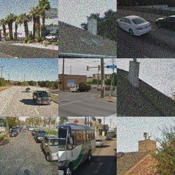

# zero-shot-captcha-solver

A zero-shot captcha solver built on top of the multi-modal vision and language model [CLIP](https://arxiv.org/abs/2103.00020) and hosted in a [Streamlit application](https://zero-shot-captcha-solver.streamlit.app/). It is zero-shot as it does not require showing any labelled examples but works out of the box
for arbitrary captcha images.

## 1. Task Description

Given a captcha image  like the one below and an object to look out for - "chimney" in this case - the goal is to classify each individual image in the 3x3 grid into either being a hit (and therefore containg the object) or not.

## 2. Implementation Details

Below is a list of steps that the application follows:
1. Turn single image of 3x3 images into 9 individual images
2. Compute an embedding vector for each of the 9 individual images, and one single embedding vector for the object to search out for
3. Compute the pairwise cosine-similarity between the embedding of each of the 9 images and the text embedding
4. Cluster the thereby returned similarity scores - one for each image - into "match" or "no match"
    - sort the similarity scores and corresponding images in an ascending order
    - compute the differences between the current and the next element in this sorted list
    - find the largest difference/gap in similarity scores and use that gap to classify all images below as "no match" and all images above as "match"

## 3. Demo

Currently there are two demos.

### 3.1 Streamlit application

I wrapped this project into a streamlit application and hosted it on their servers: https://zero-shot-captcha-solver.streamlit.app/

### 3.2 Jupyter Notebook

Find a notebook that runs through the code at the example of one captcha image at `demo.ipynb`.

## 4. How to Install

There are two ways to install the required dependencies and run the code locally:

### 4.1 With poetry

This will install `zero-shot-captcha-solver` as a library within the virtual poetry environment.

1. Clone the repository
2. Install poetry
3. From the root of the repository, install `zero-shot-captcha-solver` by executing `poetry install`

### 4.2 Without poetry

This won't install `zero-shot-captcha-solver` as a library.

1. Clone the repository
2. Install the (dev) requirements with `pip install -r requirements(-dev).txt`

## 5. Special Thanks

Special thanks to:

- The whole [Streamlit](https://streamlit.io/) team for allowing to host streamlit applications for free on their infrastructures.

## 6. License

The code itself is licenced under the MIT License.
